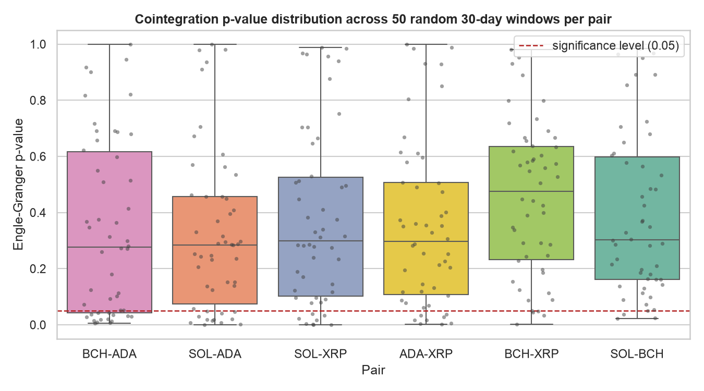
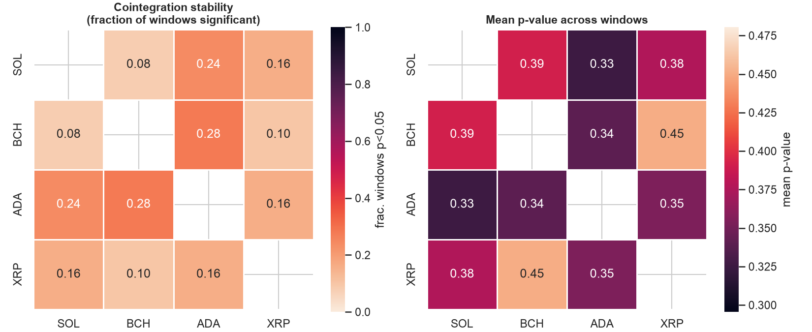
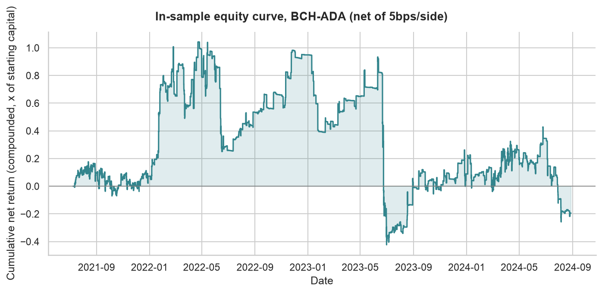
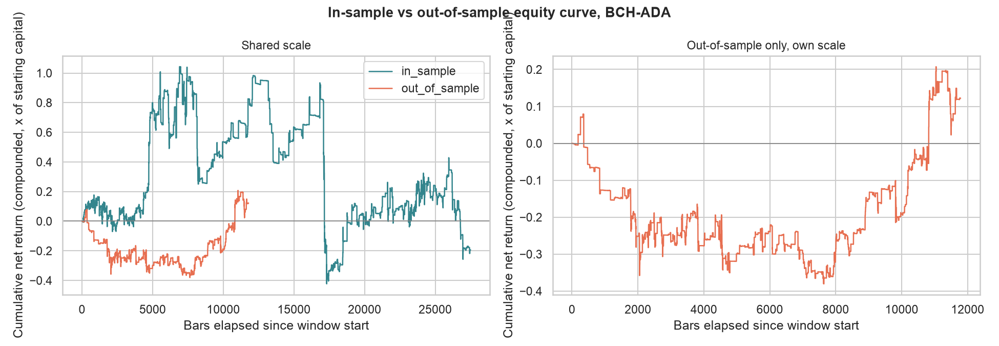
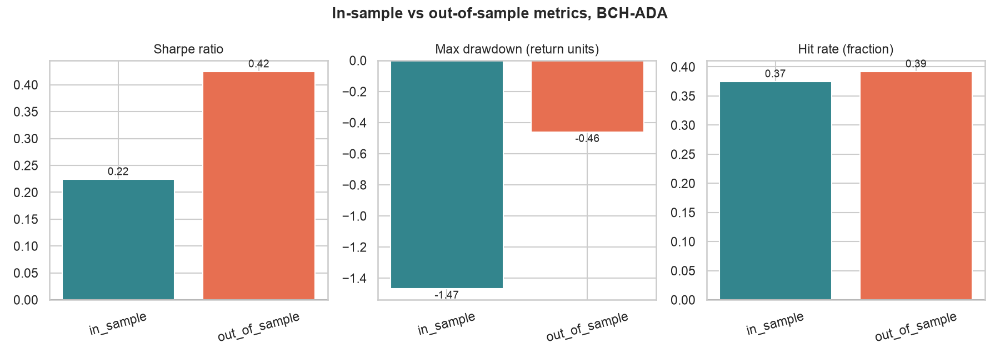
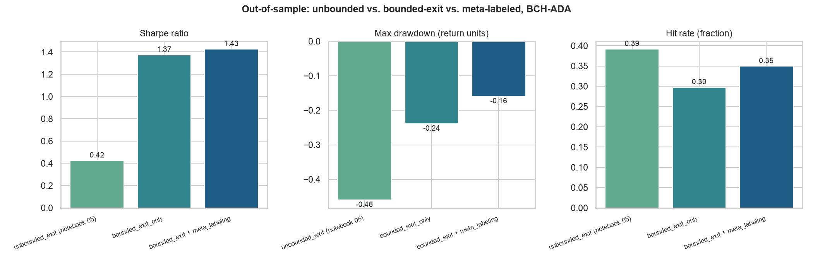
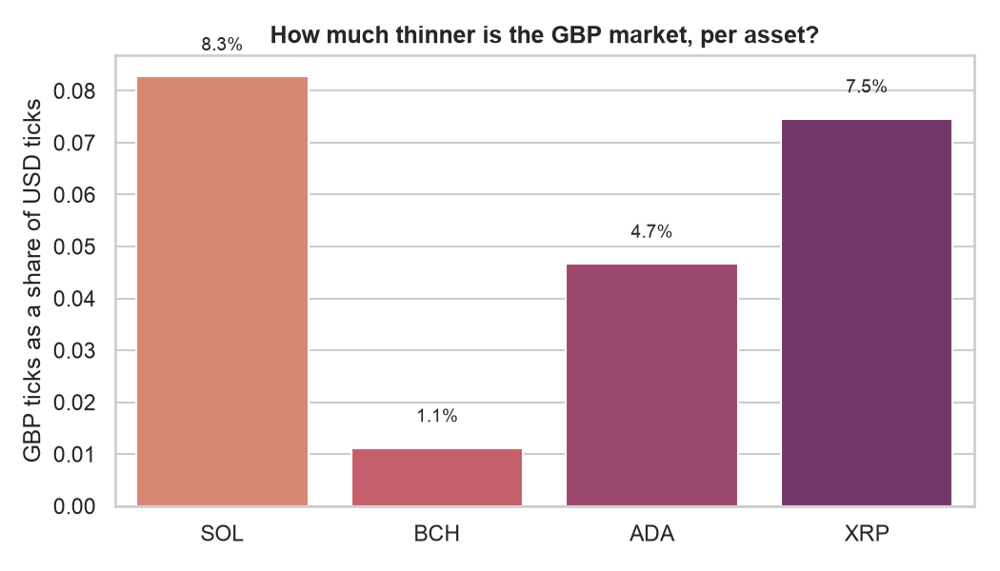
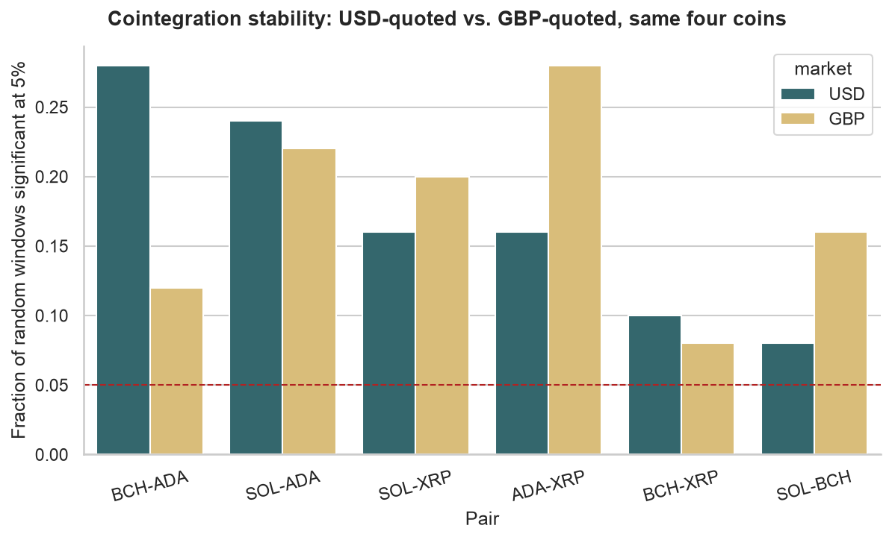

# Cross-Asset Cointegration Signal: Digital Assets

A research-note-style walkthrough of building a cointegration-based pairs
signal on crypto tick data. It goes from raw Kraken exports, through a
walk-forward, cost-adjusted, out-of-sample backtest, and then to auditing
the finished project with four independent review agents before calling it
done. This is a research exploration, not a production trading system, and
the headline result is an honest one. It only looks the way it does because
that audit process caught and fixed two real bugs that were quietly
flattering the original numbers. The pair this project actually trades
**loses money in-sample and is only modestly, not convincingly, profitable
out-of-sample**. That's reported in full because it's what the corrected
pipeline actually produces, not because it's the more flattering story.

## Overview

This project scans four liquid crypto assets on Kraken, SOL, BCH, ADA and
XRP, for pairwise cointegration. Cointegration means two price series can
each wander around unpredictably on their own, but the *gap between them*
tends to snap back to a stable long-run average rather than drifting apart
forever. That's the property a pairs trade needs: buy the cheap one, sell
the expensive one, and wait for the gap to close.

The project builds a time-varying hedge ratio (using a Kalman filter,
explained below) for the most stable pair, trades a z-score of the
resulting spread with entry and exit thresholds, and backtests it net of a
stated transaction-cost assumption with a proper walk-forward train/test
split (train the model on the first chunk of history, test it unchanged on
a later chunk it never saw).

**Headline finding:** of the six possible pairs, none is strongly
cointegrated in the textbook sense. The best pair (BCH-ADA) only tests
significant at the 5% level in 28% of 50 random 30-day windows (more on
what "significant at 5%" means below). It's traded anyway, because it's the
most stable of the six and that choice was locked in *before* looking at
backtest performance. It produces a **losing** in-sample backtest (Sharpe
0.22, minus 19% total return) and a **modestly positive** out-of-sample
backtest (Sharpe 0.42, plus 12%). Both of those Sharpe numbers sit well
within their own margin of error of zero (more on that below too). The
runner-up pair from the scan, SOL-ADA, would have backtested far better
in-sample (Sharpe 1.31) had it been picked instead. It wasn't substituted
in after the fact, on purpose. See [Results](#results) and
[Limitations](#limitations--honest-caveats).

**This result only exists in its current form because of a self-audit.**
The first version of this pipeline had two real bugs: a random-seed reuse
bug that made all six candidate pairs test the *same* 50 calendar windows
instead of genuinely independent ones, and a look-ahead leak in the z-score
signal's numerical-stability guard. Both were caught by a set of
independent review agents built specifically for this project (see
[Self-Auditing Review Process](#self-auditing-review-process)). Fixing them
changed which pair gets traded and flipped the in-sample/out-of-sample
story. The full audit trail is in [`AUDIT.md`](AUDIT.md).

## Motivation

Cointegration-based stat arb (statistical arbitrage) is a classic
market-neutral strategy family. If two assets share a long-run equilibrium
relationship, temporary wobbles away from that relationship are tradeable.
Crypto majors are an interesting test bed for this because they share a lot
of common beta (they all tend to move with the broader market and BTC)
without necessarily sharing a stable *relative* value relationship. That's
exactly the gap between "these two assets are correlated" and "this pair is
cointegrated," and this project's scan is built to surface that gap
honestly instead of assuming it away.

SOL, BCH, ADA and XRP were picked as four liquid, well-established Kraken
majors with long tick-data history, deliberately avoiding stablecoin pairs
or wrapped/derivative tickers that would make the "genuine relative value"
question less interesting. The analysis leans on market-microstructure
intuition from FX and crypto dealing (how bid/offer spreads move, how
order flow drives short-term price swings) to explain why a spread signal
needs a real cost model, a proper walk-forward split, and, as this
project's own audit process demonstrated, independent verification, before
any of it means anything.

## Data

- **Source:** Kraken time-and-sales tick exports (`unixtime, price, volume`,
  no header row).
- **Assets:** SOL, BCH, ADA, XRP (all quoted in USD), plus a "nicher" GBP-quoted
  version of the same four coins used in the [Nicher Pairs](#nicher-pairs-does-less-flow-mean-more-opportunity)
  section.
- **Raw tick counts:** SOL 26.4M, BCH 9.4M, ADA 18.5M, XRP 31.0M ticks.
- **History constraint:** SOL only lists on Kraken from 2021-06-17. BCH, ADA
  and XRP go back to 2017/2018. Every asset is trimmed to the common window
  `[2021-06-17, 2025-12-31]` (SOL's listing date is the binding constraint)
  **before** any dollar-bar threshold is derived. Sizing thresholds on each
  asset's full history first, then trimming, was an early failure mode (see
  `CLAUDE.md`) that produced dollar bars with very different calendar
  spacing per asset and broke cross-asset alignment downstream.
- **Data quality note:** a handful of listing-day ticks contain obviously
  stale or placeholder prices (for example BCH's first print on 2017-08-01
  at \$600,000 against 0.00005 volume). That's outside the trimmed common
  window used here, but worth knowing about if extending the history
  further back.

See `notebooks/01_data_exploration.ipynb` for the full breakdown, including
a history-coverage chart and the daily-return correlation structure across
the common window.

## Methodology

1. **Dollar bars** (`src/data/bars.py`). Bucket ticks by cumulative dollar
   volume per asset (2,000 bars/asset), rather than by clock time. See "Why
   dollar bars, not time bars?" below for what that buys us and why it's
   the standard approach on a real trading desk.
2. **Cross-asset alignment** (`src/data/alignment.py`). Backward-fill each
   asset's dollar bars onto a shared hourly calendar grid, so all four
   assets can be compared on the same time axis. A `merge_asof` join across
   four independently-bucketed dollar-bar series was tried first and
   produced very few matches, because dollar-bar timestamps don't line up
   closely enough across assets with different bucket spacing. The
   calendar-grid approach trades a bit of staleness (a grid point can
   repeat the same bar value through a quiet period) for a consistent,
   joinable time axis across all four assets.
3. **Unit-root check** (`notebooks/03_cointegration_scan.ipynb`). Before
   testing whether two series are cointegrated, you first need each series
   on its own to be what statisticians call "integrated of order 1," or
   I(1) for short. In plain terms: the raw price level should wander
   without a fixed anchor (like a random walk), but the *change* from one
   bar to the next should be stable and mean-reverting. This is checked
   with an Augmented Dickey-Fuller (ADF) test, which is just a statistical
   test for exactly that "wanders vs. is anchored" property. All four
   assets pass. Skipping this check is a common mistake, since the
   cointegration test downstream silently assumes it's true.
4. **Cointegration scan** (`src/signals/cointegration.py`). An
   Engle-Granger test (the standard statistical test for "do these two
   series share a stable long-run relationship") across all six asset
   pairs, run over 50 random 30-day windows per pair rather than one fixed
   window. Each pair gets its own random seed (the starting point for the
   random-number generator that picks which 30-day windows to sample), so
   the six pairs test genuinely different calendar windows instead of
   accidentally testing the same 50 periods six times over. The result is
   reported as a *distribution* of p-values (a p-value is roughly "how
   surprising would this result be if there were actually no relationship
   at all," and a smaller number means more surprising, i.e. more
   evidence of a real relationship) rather than a single pass/fail,
   alongside an explicit check on how many "significant" results you'd
   expect by pure chance if nothing were really going on.
5. **Hedge ratio** (`src/signals/hedge_ratio.py`). A Kalman filter, which
   is just a way of estimating a number that's allowed to drift slowly
   over time, updating its best guess every time a new price comes in,
   rather than fitting one fixed ratio to the whole history and hoping it
   stays valid. Seeded from an ordinary linear regression fit on the
   calibration window, using `sklearn.linear_model.LinearRegression`.
6. **Signal** (`src/backtest/engine.py`). A rolling z-score of the spread.
   A z-score just answers "how many standard deviations away from its
   recent average is this value right now," so a z-score of 2 means "this
   is an unusually large gap by recent standards." The strategy enters a
   trade when `|z| >= 2.0` and holds it until `|z| <= 0.5` (this gap
   between the entry and exit thresholds, called hysteresis, stops the
   strategy from flipping in and out of a trade every time the z-score
   wobbles near the entry line).
7. **Backtest** (`src/backtest/engine.py`, `src/backtest/costs.py`).
   Returns are worked out as a percentage of the position's actual
   capital at risk (not a raw hedge-ratio-weighted number, which wouldn't
   translate into a sensible percentage), net of a stated 5 basis points
   (0.05%) per side cost assumption. Every Sharpe ratio reported also
   comes with a standard error, a rough measure of how much that number
   could plausibly bounce around by chance alone, so a "big" Sharpe with a
   big standard error isn't as impressive as it looks at first glance.
8. **Out-of-sample test** (`src/backtest/engine.py`). A chronological
   walk-forward split: 70% of the history is "train" and the last 30% is
   "test." The Kalman filter's starting point, the pair's train-window
   cointegration check, and the z-score thresholds are all locked in using
   train data only, then applied unchanged to the held-out test window.
9. **Self-audit** (`.claude/skills/`, `AUDIT.md`). Four independent review
   agents checked the finished pipeline against AFML methodology (a
   well-known playbook for financial machine learning, explained more
   below), general statistical validity, chart honesty, and whether the
   written narrative actually matches the numbers, before the project was
   called done. See below.
10. **Meta-labeling extension** (`src/signals/meta_labeling.py`,
    `notebooks/06_meta_labeling.ipynb`). Bounded exits (a stop-loss and a
    maximum holding period, not just "wait for reversion however long that
    takes") and a gradient-boosted machine learning model that sizes each
    trade by predicted conviction instead of treating every trade the
    same. Added after the audit, specifically to close two of its own
    findings. See [Extension: Meta-Labeling](#extension-meta-labeling).
11. **Nicher pairs** (`notebooks/07_nicher_pairs.ipynb`). The same four
    coins, re-run in GBP instead of USD, a much thinner market for all
    four. Tests whether a less-traded version of the same asset shows a
    different cointegration signal or a bigger backtest opportunity. See
    [Nicher Pairs](#nicher-pairs-does-less-flow-mean-more-opportunity).

Work through the notebooks in order (`01` through `07`) for the full
narrative, code and plots behind each step.

### Why dollar bars, not time bars? (Production relevance)

Sampling by cumulative dollar volume instead of clock time isn't just an
academic preference for tidier statistics. It's the same reasoning a real
trading desk applies to sampling and execution, and it's worth defending
properly rather than treating it as a given.

- **Clock-time bars sample activity unevenly.** Crypto trades 24/7, but
  liquidity and information arrival don't. A fixed 1-hour bar during a
  quiet Sunday-night Asia session captures almost no real price discovery,
  while the same 1-hour bar around a large flow event or a macro headline
  can contain most of a day's genuine information. That uneven spread of
  "how much actually happened" is exactly what the Engle-Granger and
  Dickey-Fuller tests in this project assume doesn't exist. Feeding them
  clock-time bars would quietly bias the significance levels being
  reported.
- **Dollar bars sample by a fixed amount of economic activity instead.**
  Each bar closes once a fixed notional has traded, so every bar
  represents a roughly comparable amount of new information, no matter
  when it happened. Bars built this way are empirically closer to
  behaving like independent, identically distributed draws (the "IID"
  property that most statistical tests quietly assume) than clock-time
  bars are. This is a well-known finding in the financial machine
  learning literature (López de Prado, *Advances in Financial Machine
  Learning*, chapter 2, also the basis for this project's own
  `lopez-de-prado-checker` audit skill). The bar-spacing chart in
  `notebooks/02_dollar_bars.ipynb` shows this directly: the same
  dollar-bar count per asset lines up with wildly different *calendar*
  spacing depending on how active the market was at the time. That's the
  whole point. A clock-time scheme would have forced every asset onto the
  same artificial rhythm regardless of how much actually happened during
  it.
- **Dollar bars specifically, rather than volume bars, matter in crypto**
  because prices here move by an order of magnitude within one sample.
  SOL alone ranges roughly \$8 to \$296 in this dataset. A volume bar
  (a fixed number of coins) represents wildly different dollar risk
  before and after a move like that. A dollar bar stays comparable in
  economic terms the whole way through, which is the same reason
  execution algorithms (VWAP, percentage-of-volume, implementation
  shortfall schedules, all standard ways of splitting a large order up
  over time) are scheduled against traded value or volume rather than
  the clock. Price impact scales with how much of the market's activity
  you represent, not with how many minutes have gone by.
- **This mirrors how a dealing desk actually refreshes a fair-value or
  hedge model**, against incoming flow and traded notional, not strictly
  against a timer. It's the same intuition, just applied here to signal
  construction rather than execution.
- **The honest trade-off:** none of this survives contact with needing a
  *shared* clock across four assets to run a pairwise test at all. That's
  why the calendar-grid backward-fill alignment step comes immediately
  after, reintroducing a time axis out of necessity. It's a disclosed
  compromise (see Limitations), not a contradiction of everything above.

## Self-Auditing Review Process

Once the pipeline ran end to end and the notebooks executed for real, this
project was reviewed by four independent, narrowly-scoped agents rather
than one self-review pass. Each one was briefed with only the specific
files its job needed, not the builder's own reasoning or suspicions, so it
couldn't just quietly confirm whatever was already believed:

- **`lopez-de-prado-checker`**: financial machine learning rigor, based on
  Marcos López de Prado's *Advances in Financial Machine Learning* (often
  shortened to AFML). Checks things like whether the data sampling is
  genuinely close to IID, whether trades are sized by conviction, how
  exits and labels are designed, and whether the pair-selection process
  was quietly biased by trying lots of candidates and only reporting the
  winner (this bias has a name, "Probability of Backtest Overfitting").
- **`probability-test-checker`**: general statistical validity. Are the
  tests' own assumptions actually checked, is there a correction for
  running many tests at once, are the "random" windows actually
  independent of each other, and does every headline number come with
  some sense of how uncertain it is.
- **`chart-sense-checker`**: whether every chart is visually honest. Are
  the axis units clear, do colour scales point the same direction across
  related charts, does the chart type suit how much data is actually
  behind it.
- **`narrative-checker`**: whether the README and notebook write-ups
  actually match the numbers in `outputs/tables/`, whether limitations are
  stated up front rather than buried, and whether the fact that a pair was
  picked from six candidates is made obvious rather than glossed over.

The four checkers found two genuine bugs: a shared-seed leak in the
cointegration scanner, and a look-ahead leak in the z-score signal. Both
are fixed, both are now covered by regression tests (automated tests
written specifically to make sure these exact bugs can't silently come
back), and both were serious enough to change the selected pair and the
headline result. They also found, and this project fixed, several
statistical-rigor gaps (a missing unit-root prerequisite check, an
undisclosed multiple-comparisons baseline, no uncertainty measure on any
Sharpe ratio) and chart-clarity issues (unclear return-axis units, metrics
with different units sharing one bar-chart axis). The full findings,
including everything deliberately left alone and why, are in
[`AUDIT.md`](AUDIT.md).

Two of the deferred findings, flat bet sizing and no stop-loss or
maximum-holding-period exit, were later closed by scanning
[awesome-systematic-trading](https://github.com/paperswithbacktest/awesome-systematic-trading)
(an open-source, community-maintained list of trading tools and libraries)
for ideas that fit this exact gap. It surfaced Hudson & Thames' MlFinLab,
the reference implementation of AFML's triple-barrier and meta-labeling
pattern, which this project's
[meta-labeling extension](#extension-meta-labeling) is built from scratch
to follow. Useful enough to be worth crediting explicitly rather than
pretending the idea came from nowhere.

## Results

**Cointegration scan** (`notebooks/03_cointegration_scan.ipynb`). BCH-ADA
is the most stable pair of six, testing cointegrated (a p-value under 0.05,
meaning "a result this strong would be unlikely if there were really no
relationship") in 28% of 50 random 30-day windows. Every other pair is
stable in 8 to 24% of windows. Across all 300 tests, 51 came back
significant at that 5% level, against a chance baseline of roughly 15
expected false positives if none of the pairs were actually related at
all. That's meaningfully above chance, though the scan's windows aren't
fully independent draws of each other (see notebook 03's
multiple-comparisons discussion for the maths). No pair clears a bar
anywhere close to "reliably cointegrated." The honest takeaway is that
this is a small, correlated-but-not-obviously-cointegrated group of
assets, and BCH-ADA is simply the least unstable of the six.




**In-sample backtest, all six candidate pairs**
(`notebooks/04_backtest.ipynb`, net of 5 basis points per side). Reported
for every pair, not just the winner, since the selected pair's number only
means something in that context:

| Pair | Sharpe | Sharpe SE | Max drawdown | Hit rate | Total return |
|---|---|---|---|---|---|
| SOL-ADA | 1.31 | 0.56 | 5.93 | 37.5% | +846% |
| **BCH-ADA (selected)** | **0.22** | **0.56** | **1.47** | **37.4%** | **19% loss** |
| BCH-XRP | 0.14 loss | 0.56 | 2.41 | 32.2% | 54% loss |
| SOL-XRP | 0.24 loss | 0.56 | 0.93 | 30.6% | 80% loss |
| SOL-BCH | 0.43 loss | 0.56 | 0.93 | 41.8% | 74% loss |
| ADA-XRP | 0.58 loss | 0.56 | 1.43 | 31.0% | 81% loss |

("Sharpe" here is return per unit of risk taken, so higher is better and
negative means the strategy lost money on a risk-adjusted basis. "Max
drawdown" is the worst peak-to-trough dip the strategy went through,
expressed the same way as total return.)

The selected pair is not the best-backtesting one. It was chosen purely on
cointegration stability, before any backtest ran, and it's carried forward
unchanged rather than swapped for the better-looking runner-up.



**Walk-forward out-of-sample** (`notebooks/05_out_of_sample.ipynb`,
BCH-ADA). Same hedge-ratio filter (warm-started on train data only, then
run as one continuous pass across train and test, checked to give
bit-for-bit identical numbers to an isolated train-only run, which is what
closed the look-ahead leak found in the audit), same z-score thresholds,
same cost assumption, scored separately on each window:

| Metric | In-sample | Out-of-sample |
|---|---|---|
| Sharpe | 0.22 | **0.42** |
| Sharpe SE | 0.56 | 0.86 |
| Max drawdown | 1.47 | 0.46 |
| Hit rate | 37.4% | 39.1% |
| Total return | **19% loss** | **+12%** |




Out-of-sample Sharpe is *higher* than in-sample here, the opposite of the
usual "in-sample flatters, out-of-sample disappoints" pattern. That's
arguably a more interesting result precisely because it isn't the
flattering direction: a pre-registered, performance-blind pair-selection
process picked a pair that lost money on the window used to calibrate it,
and only turned modestly positive on the untouched holdout. Both Sharpe
ratios sit well within one standard error of zero (0.22 give or take 0.56,
0.42 give or take 0.86), so neither should be read as a demonstrated edge.
See `outputs/tables/` for the full numeric tables behind every chart in
this README.

## Extension: Meta-Labeling

`AUDIT.md` deferred two findings: flat, non-conviction-scaled bet sizing,
and no stop-loss or maximum-holding-period exit. `notebooks/06_meta_labeling.ipynb`
closes both. Every trade entry is now bounded by a "triple barrier": it
exits on profit-take (the original reversion rule), a stop-loss (a bigger
adverse move than entry), or a maximum holding period, whichever comes
first. On top of that, a gradient-boosted machine learning model (XGBoost)
trained on the outcomes of past trades sizes each new bet by its predicted
probability of success, using AFML's standard formula
`size = max(2p - 1, 0)`. In plain terms: if the model thinks a trade is
barely better than a coin flip, don't bother sizing it up much; the more
confident it is, the bigger the bet, up to a cap. This replaces a flat "buy
one unit whenever the signal fires" rule. Built from scratch
(`src/signals/meta_labeling.py`), directly inspired by
[Hudson & Thames' MlFinLab](https://github.com/hudson-and-thames/mlfinlab).

Isolating the two changes on the out-of-sample window (BCH-ADA):

| Variant | Sharpe | Max drawdown | Hit rate |
|---|---|---|---|
| Original (unbounded exit, flat sizing) | 0.42 | 0.46 | 39.1% |
| Bounded exit only (stop-loss and max hold, still flat sizing) | 1.37 | 0.24 | 29.7% |
| Bounded exit plus meta-labeling (conviction-sized) | 1.43 | 0.16 | 34.9% |



**Bounding the exit did almost all of the work.** The original strategy's
weak result owed a lot to letting losing trades run indefinitely, waiting
for a reversion that sometimes took far longer than it was worth. A hard
stop-loss alone roughly tripled the out-of-sample Sharpe. Meta-labeling
added a further, smaller improvement in Sharpe while *reducing* total
return. That's expected: sizing down lower-conviction bets is supposed to
cost some upside in exchange for cutting weaker trades, and it does here,
reported honestly rather than dressed up as an unambiguous win.

**The meta-model's held-out AUC was 0.88.** AUC ("area under the curve") is
a standard way of scoring a yes/no classifier: 0.5 means no better than a
coin flip, 1.0 means perfect. 0.88 is high for only around 300 training
events, and it's not a leak. The dominant feature, by a wide margin, is
the z-score size at entry, which mechanically predicts stop-out risk
because of how close a given entry sits to the stop-loss barrier by
construction. That's a useful, legitimate signal, but one a much simpler
rule (size down entries that are close to the stop) would probably capture
most of. The meta-model isn't doing as much independent work as the AUC
alone might suggest, and notebook 06 says so directly instead of taking
full credit for what's really the barrier's own geometry.

One simplification worth flagging: entries are still identified from the
primary model's own unbounded position array, so an early triple-barrier
exit doesn't trigger a fresh re-entry within what the primary model still
considers one continuous trade opportunity. See notebook 06 and
`AUDIT.md`'s 2026-09-15 addendum for the full write-up, including why a
PyMC-based Bayesian approach (also surfaced by the same GitHub list) was
considered and not pursued here.

## Nicher Pairs: Does Less Flow Mean More Opportunity?

Everything above uses the USD-quoted version of SOL, BCH, ADA and XRP, by
far the busiest market for each coin on Kraken.
`notebooks/07_nicher_pairs.ipynb` asks a simple follow-up question: what
happens if you run the exact same pipeline on the *same four coins*,
quoted in GBP instead? GBP is a much thinner market for all four. Using
the same coins rather than switching to different, smaller-cap ones keeps
"how much less flow" as the one thing being tested, instead of also
changing which assets are involved.

**How much thinner is GBP, really?** Measured by tick count over the same
common window used everywhere else in this project:

| Asset | GBP ticks as a share of USD ticks |
|---|---|
| SOL | 8.3% |
| BCH | 1.1% |
| ADA | 4.7% |
| XRP | 7.5% |



BCH-GBP in particular trades at roughly 1% of BCH-USD's tick volume over
the same window, a genuinely niche market by comparison.

**Cointegration stability, USD vs. GBP, pair by pair:**



The picture is mixed, not a clean "less liquid means more" or "less
liquid means less" story. BCH-ADA is noticeably *less* stable in GBP (28%
of windows significant, down to 12%), while ADA-XRP is noticeably *more*
stable (16% up to 28%). Three of six pairs improve in GBP, three get worse.
That's a genuinely honest result rather than a cherry-picked one: this
project isn't set up to find a particular answer, just to check.

**Does the most stable GBP pair actually backtest better?** The best GBP
pair by the same pre-registered selection rule is ADA_GBP-XRP_GBP.
Running it through the identical hedge ratio, signal and walk-forward
pipeline as BCH-ADA:

| Metric | USD (BCH-ADA) in-sample | USD (BCH-ADA) out-of-sample | GBP (ADA-XRP) in-sample | GBP (ADA-XRP) out-of-sample |
|---|---|---|---|---|
| Sharpe | 0.22 | 0.42 | 0.81 | 1.04 |
| Total return | 19% loss | +12% | +155% | +90% |

The GBP pair backtests meaningfully better on both windows. That's a
genuinely interesting result in favour of the "less flow, more
opportunity" idea, but it comes with an important asterisk: **both
backtests use the same flat cost assumption**, and that's optimistic for
the thinner GBP market specifically. A market trading at 1 to 8% of the
USD tick volume almost certainly has wider spreads and worse slippage for
the same trade size, and this project has no GBP-specific fee estimate to
plug in instead (the original cost assumption was already only a
placeholder for the *more liquid* USD market, see `AUDIT.md`). Read the
GBP outperformance as an upper bound on the opportunity, not a
like-for-like comparison, until a realistic GBP cost estimate replaces the
shared placeholder.

## Limitations & Honest Caveats

- **Single train/test split, single pair, single roughly 4.5-year sample.**
  The out-of-sample result is one draw, not a robust estimate of expected
  live performance.
- **BCH-ADA is only marginally cointegrated** (28% of random windows
  significant at 5%). It was the *most stable* of six candidates, not a
  strongly cointegrated pair, and (see the all-pairs table above) not the
  pair with the best in-sample backtest either. A different set of assets
  or a different period should be expected to give a materially different
  result.
- **No embargo gap at the walk-forward boundary.** The hedge-ratio filter
  and z-score rolling window run continuously across the train/test cut
  with zero buffer, so the first few out-of-sample observations are
  scored using state that's still mostly informed by train data.
- **The headline result above still uses flat sizing and an unbounded,
  reversion-only exit.** The [meta-labeling extension](#extension-meta-labeling)
  closes both gaps and materially improves the out-of-sample Sharpe, but
  is presented separately rather than folded into the headline numbers,
  since it was added after the pair and strategy were already selected
  and shouldn't retroactively flatter a result that was reported honestly
  before the extension existed.
- **The meta-model is trained on roughly 300 discrete entry events.**
  Workable for a shallow, heavily regularised gradient-boosted classifier,
  but still a small sample by machine learning standards. Its unusually
  strong 0.88 held-out AUC is explained, in the extension section above,
  as mostly a structural property of the barrier geometry rather than a
  hard-won predictive signal.
- **The GBP comparison shares the same cost assumption as the USD
  analysis**, which is almost certainly too generous for a market with 1
  to 8% of the tick volume. Any GBP outperformance should be read as an
  upper bound, not a confirmed edge.
- **The cointegration scan's 50 random windows per pair aren't fully
  independent draws of each other.** The window width is a meaningful
  fraction of the total series length, so sampled windows overlap in the
  data they cover.
- **The calendar-grid alignment backward-fills sparse dollar bars onto an
  hourly grid**, which measurably shrinks the effective sample size behind
  both the cointegration scan and the z-score signal. Most hourly grid
  rows for a given asset just repeat the last dollar bar's value rather
  than reflecting new information (see `notebooks/02_dollar_bars.ipynb`
  for the duplication chart). This was a deliberate trade-off in favour
  of a consistent, joinable time axis across four assets with very
  different tick-history lengths and bar spacing, not an oversight.
- **The cost assumption of 5 basis points per side is a stated guess, not
  an empirically verified Kraken fee-plus-slippage estimate**, for this
  trade size.
- **Reported Sharpe ratios carry a large standard error relative to their
  point estimates**, even under the generous assumption that returns are
  independent of each other, which held positions actually violate (once
  you're in a trade, tomorrow's return depends on today's, so it's not a
  fresh independent draw). None of the Sharpe figures in this project
  should be read as precise to two decimal places.
- **No paper or live trading validation.** Everything here is a backtest.
  Execution latency, partial fills and queue position aren't modelled
  beyond the flat cost assumption.
- **The Kalman filter's two tuning constants** (`delta` and
  `observation_covariance` in `config/config.yaml`) **are fixed values
  chosen once**, not tuned via a proper train/validation split or
  optimised against either window's performance.
- **No formal correction for having screened six candidate pairs**, the
  kind of thing "Probability of Backtest Overfitting" or "Deflated Sharpe
  Ratio" methods exist to handle. The all-pairs comparison table is a
  partial, honest mitigation (the reader can see the spread the winner
  was drawn from), not a full statistical correction.

## Project Structure

```
.
├── .claude/skills/     # the four audit checkers + the project-audit orchestrator
├── AUDIT.md            # full self-audit findings and dispositions
├── config/             # signal, backtest, and alignment parameters
├── data/                # raw + processed data (gitignored, not committed)
├── notebooks/           # exploration -> scan -> backtest -> OOS -> extensions, in order
├── outputs/             # figures and tables referenced in this README
├── src/
│   ├── data/             # loading, dollar bars, cross-asset alignment
│   ├── signals/          # cointegration scan, Kalman hedge ratio, meta-labeling
│   ├── backtest/         # signal, cost model, backtest engine
│   ├── evaluation/       # performance metrics
│   └── utils/            # config loading
└── tests/
```

### Why the folder structure looks like this

This section is here mainly for anyone reviewing this project as a work
sample rather than reading it purely for the trading result. The layout
follows a few deliberate rules, and they're the same rules that make a
codebase workable at a real trading firm once more than one person is
touching it, not just conventions picked for their own sake.

- **`src/` is split by responsibility, not by asset or by notebook.**
  `data/`, `signals/`, `backtest/`, `evaluation/` and `utils/` each own
  one job (loading and bar construction, statistical signal generation,
  execution and cost modelling, performance measurement, and shared
  config plumbing). Nothing in `signals/` knows how a backtest applies
  costs, and nothing in `backtest/` knows how a dollar bar gets built.
  That separation is what lets a class like `CointegrationScanner` or
  `KalmanHedgeRatioEstimator` be reused unchanged across notebooks 03,
  04, 05, 06 and 07 without copy-pasting logic into each one. A monolithic
  "one big script per notebook" approach would have made the meta-labeling
  extension in notebook 06, or the GBP re-run in notebook 07, each require
  rewriting the whole pipeline instead of importing the existing classes
  and pointing them at different config.
- **Everything in `src/` is a small, testable class with one job**, not a
  loose collection of top-level functions. `DollarBarBuilder`,
  `CalendarAligner`, `TripleBarrierLabeler` and so on can each be
  constructed with explicit parameters and unit tested in isolation
  (see `tests/`, which mirrors the `src/` layout file for file). That
  mirroring is deliberate: if you're looking at `src/signals/meta_labeling.py`
  and want to know what behaviour is actually guaranteed, `tests/test_meta_labeling.py`
  is the first place to look, and it's easy to find because the names
  line up.
- **`config/config.yaml` is the single source of truth for every tunable
  number.** Lookback windows, entry and exit thresholds, cost assumptions,
  the list of assets and pairs, all of it lives in one file, not scattered
  across notebook cells as hardcoded literals. That's what let the "nicher
  pairs" extension (`nicher_assets`, `nicher_pairs`) get added as a few
  new config lines rather than a forked copy of the pipeline, and it's
  what makes it possible to answer "what parameters actually produced this
  number" by reading one file instead of grepping through seven notebooks.
- **Notebooks are a narrative pipeline, not the place logic lives.** Each
  notebook imports from `src/` and mainly does three things: load data,
  call the reusable classes, and plot or print the result. The heavy
  lifting (the actual statistics, the actual backtest math) is in `src/`,
  where it can be tested and reused. Notebooks are numbered `01` through
  `07` because each one is a step that depends on the ones before it
  (you can't backtest before you've picked a pair, and you can't pick a
  pair before you've built the data), and that ordering is meant to be
  read top to bottom like a report, not jumped around in.
- **`outputs/` holds only generated artifacts** (figures and tables),
  never hand-written content. Everything in there is reproducible by
  re-running the notebooks, and nothing in there needs to be hand-edited
  or trusted blindly, since `narrative-checker` (see the audit section
  above) exists specifically to catch it drifting out of sync with what
  the README claims.
- **`.claude/skills/` is a self-contained review layer, separate from
  both `src/` and the notebooks.** It doesn't import from or get imported
  by any of the trading logic. It's a set of independent instructions
  for reviewing the *rest* of the project, deliberately kept separate so
  that reviewing the code doesn't require trusting the code being
  reviewed. That separation between "the system" and "the thing that
  checks the system" is the same principle behind keeping test code out
  of production code, just applied one level up.

Everything in `src/` is built on Polars for data wrangling, statsmodels for
the Engle-Granger and ADF tests, pykalman for the Kalman filter,
scikit-learn for the linear regression that seeds the filter's starting
point, XGBoost for the meta-labeling classifier, and seaborn and
matplotlib for every chart in this README and the notebooks.

## Reproducing This

```bash
python -m venv .venv
source .venv/bin/activate
pip install -r requirements.txt
cp .env.example .env   # only needed if extending beyond the Kraken CSV pipeline
```

Raw Kraken tick CSVs (`unixtime, price, volume`, no header) go in
`data/raw/<TICKER>.csv` (for example `data/raw/SOL.csv`, or
`data/raw/SOL_GBP.csv` for the nicher-pairs extension). They aren't
committed to this repo (see `.gitignore`). This project used Kraken's own
historical time-and-sales exports for SOL, BCH, ADA and XRP, against both
USD and GBP.

Then run the tests and work through the notebooks in order:

```bash
pytest
jupyter nbconvert --to notebook --execute --inplace notebooks/0*.ipynb
```

Each notebook writes its figures to `outputs/figures/` and its tables to
`outputs/tables/`, in the order: `01` data exploration, `02` dollar bars and
alignment, `03` cointegration scan, `04` in-sample backtest, `05`
walk-forward out-of-sample evaluation, `06` meta-labeling extension, `07`
nicher pairs. See [`AUDIT.md`](AUDIT.md) for the self-audit findings, and
`.claude/skills/project-audit/SKILL.md` to re-run the same review process
after future changes.
