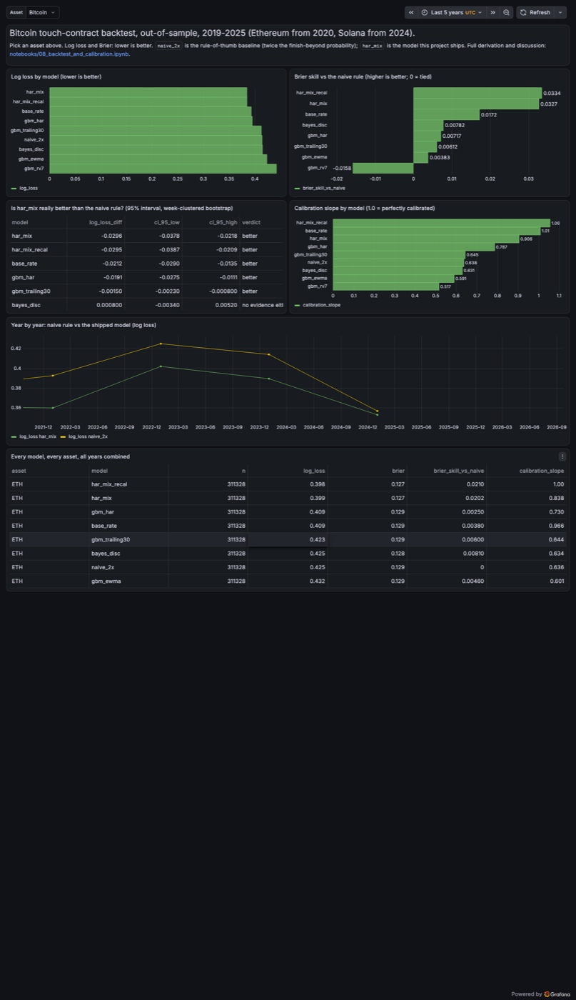
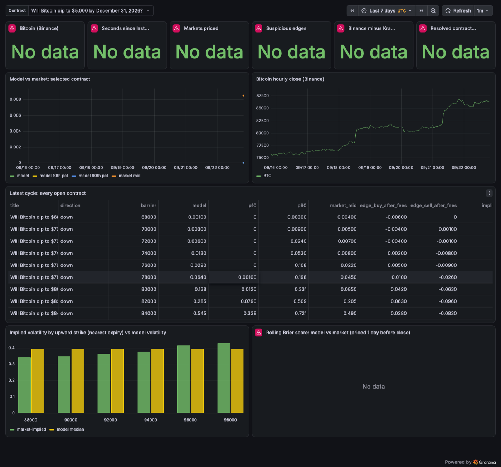

# pm-bayes-pricer

**Pricing "will it touch the level?" crypto prediction-market contracts from 92 million Kraken
trades: first-passage maths, Bayesian volatility, a walk-forward backtest, and a live paper-trading
pricer against Polymarket.**

Written as a research note. The maths is the point: every formula is derived in plain English in a
notebook and checked against simulation in a test.

## See the results (2 minutes, nothing to install)

1. **The maths and the backtest** — read [notebook 4](notebooks/04_first_passage_from_scratch.ipynb)
   for the core idea (touch probability from first principles), then
   [notebook 8](notebooks/08_backtest_and_calibration.ipynb) for the results. Both render on GitHub
   with all charts and numbers already in place.
2. **The research dashboard** (Grafana, backed by the backtest above):

   

3. **The live pricer** (Grafana, backed by one real pricing cycle against Polymarket):

   

To reproduce either dashboard yourself: `make up` (needs Docker), then open http://localhost:3000.
No API keys are needed anywhere in this project.

## Scope and limits

* **Tested:** 1-, 7- and 30-day *touch* contracts ("will BTC hit $K by T?"), labelled from tick
  data the way a venue settles them. Bitcoin 2019-2025; Ethereum 2020-2025 and Solana 2024-2025 as
  checks. Confidence intervals resample **whole weeks**, since overlapping contracts aren't independent.
* **Not tested:** trading profit. The backtest has no market prices in it (that's forecast quality
  only); notebook 9 compares against a real market, but it is one snapshot.
* Paper only — no credentials, no orders. Tick data ends 2025-12-31; the live layer prices off Binance.

## Headline result (Bitcoin, out-of-sample log loss, lower is better)

| Model | Log loss | vs. rule of thumb (95% CI) |
|---|---|---|
| Rule of thumb: 2 × P(finish beyond), trailing vol | 0.4146 | — |
| + exact touch formula | 0.4131 | −0.0015 [−0.0023, −0.0008] |
| + log-HAR volatility forecast | 0.3955 | −0.0191 [−0.0275, −0.0111] |
| **+ averaged over the forecast's own error** | **0.3850** | **−0.0296 [−0.0378, −0.0218]** |

Better volatility *forecasting*, and honest uncertainty about that forecast, are what move the
number — the exact formula alone barely helps. Holds in 7/7 Bitcoin years and 5/6 Ethereum years;
inconclusive for Solana (2 years only). Full breakdown, calibration and the loss-vs-market
comparison: notebooks 8 and 9.

## What running it against real data caught

* Polymarket settles on **Binance**, not Kraken — using Kraken produced a fake 94-point "edge" once. Fixed; the exchange basis is now a monitored metric.
* Polymarket **re-lists** a strike after it's touched; each new listing's window starts at its own start time.
* An early HAR fit (in levels, not logs) over-forecast volatility 2×. Caught by out-of-sample testing, not inspection.

## The maths (notebooks, in order)

| # | Notebook | Covers |
|---|---|---|
| 1-3 | Fed-decision markets | overround removal, ladder↔bucket conversion, Dirichlet updating, scoring rules, Kelly |
| 4 | [First passage from scratch](notebooks/04_first_passage_from_scratch.ipynb) | reflection principle, closed form with drift, 1-minute monitoring correction, gambler's ruin |
| 5 | [Volatility from ticks](notebooks/05_volatility_from_ticks.ipynb) | estimators, signature plot, jumps, log-HAR forecasting |
| 6 | [Bayesian volatility](notebooks/06_bayesian_volatility.ipynb) | Inverse-Gamma updating (= EWMA), simulation-based calibration, Jensen effect |
| 7 | [Fat tails and paths](notebooks/07_fat_tails_and_paths.ipynb) | jump-diffusion, filtered historical simulation, Brownian-bridge crossing |
| 8 | [The backtest](notebooks/08_backtest_and_calibration.ipynb) | purged walk-forward, bootstrap, calibration, per-year/asset breakdown |
| 9 | [Against a real market](notebooks/09_against_a_real_market.ipynb) | implied volatility, edges after fees, Kelly |

Notebooks 5-8 read the local Kraken tick data (45 GB, not in this repo) to *re-run*; their outputs
are saved in the notebooks, so they render fine without it. Notebook 9 needs nothing extra — it
reads the small snapshot committed at `notebooks/data/live_snapshot.json`.

## Architecture

```
Kraken ticks --polars--> 1-min bars --> hourly grid --> point-in-time features
                                              |                  |
                                              v                  v
                               labels (sparse table)    walk-forward backtest --> outputs/ --> Postgres
                                                                  |                             (research dashboard)
                                                       fitted, hashed model artifact
                                                                  |
Binance + Polymarket ------------ pricer (every 60s) ------------+---> Postgres --> Grafana
                                                                  +---> Prometheus --> alerts
```

Live and backtest share one implementation of the maths; `tests/test_live_parity.py` proves they
agree to 9 significant figures.

## Quick start

Full walkthrough: **[docs/setup.md](docs/setup.md)**.

```bash
cp .env.example .env
make install     # python package + dev/notebook tools
make price-now   # price every open Polymarket BTC contract now — no Docker, no database
make up          # Postgres, collectors, pricer, Prometheus, Grafana -> http://localhost:3000
make test        # also: make lint, make typecheck
# with the Kraken tick files available locally:
make bars && make backtest && make load-scores && make train
```

## Layout

| Path | Purpose |
|---|---|
| `src/pmq/crypto/` | `barrier` (closed forms), `vol` (estimators, HAR), `bayes_vol`, `paths` (Monte Carlo), `grid`/`features`/`backtest`, `live` (production pricing), `train` |
| `src/pmq/ingest/` | Polymarket (Fed + Bitcoin touch), Kalshi, Binance, Kraken |
| `src/pmq/pricer/` | Live loop, Prometheus metrics, settlement and rolling score |
| `src/pmq/pricing`, `models`, `eval`, `risk` | Overround, ladders, fees, Dirichlet, pooling, scoring, bootstrap, Kelly |
| `config/` | One YAML per asset — every backtest parameter lives here |
| `models/` | The fitted, hashed model artifact shipped in the image |
| `grafana/`, `prometheus/` | Provisioned dashboards, datasources, alert rules |
| `tests/` | Maths tests (closed form vs. simulation, calibration, look-ahead, live/backtest parity), API contract tests, Postgres integration test |

## Design decisions

* **Maths is tested, not asserted**: closed forms vs. Monte Carlo, Bayesian update vs. numerical integration, simulation-based calibration (with a deliberately broken update that must fail it), and a test that rewrites the future to confirm forecasts don't move.
* **Purged, point-in-time**: anything fitted uses only contracts whose outcome was known on 1 January of the test year. Strikes sit on a volatility-scaled grid, not chosen by any model.
* **Kelly isn't shrunk by model variance**: expected log growth is linear in probability, so sizing on the mean is already optimal; calibration and fractional Kelly are the actual safeguards.
* **No Kafka/Kubernetes/Airflow**: a minute-interval REST poll doesn't need them; a lightweight loop plus Prometheus is the right size for this.

## Not yet done

A real backtest against *resolved* Polymarket prices (notebook 9 is a single live snapshot); dbt
marts; Kalshi crypto ladders. Docker wasn't available on the build machine — Postgres and Grafana
were verified locally via Homebrew instead (screenshots above are from that run); `docker compose`
itself is exercised for the first time by CI.
